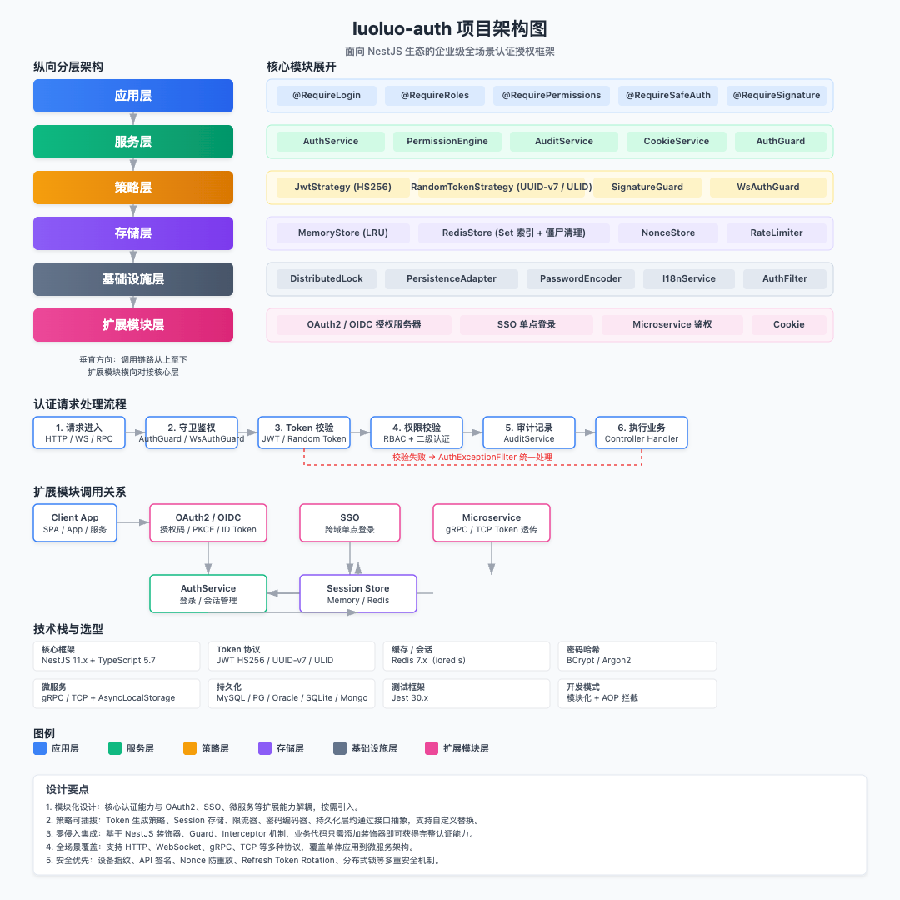

# luoluo-auth

luoluo-auth 是一款专为 NestJS 生态设计的企业级认证授权框架，对标 Java 领域广泛使用的 Sa-Token 框架，首次将 Sa-Token 的完整能力体系移植到 Node.js / NestJS 技术栈。该框架覆盖从单体应用到微服务架构、从 HTTP 到 WebSocket 的全场景认证需求，提供 JWT 与随机 Token 双策略、RBAC 权限引擎、OAuth2/OIDC 授权服务器、SSO 单点登录、API 签名认证、设备指纹绑定等完整功能，填补了 NestJS 生态在企业级认证框架领域的空白。

## 功能特性

- **JWT Token**: HS256 签名，支持自定义过期时间
- **Session 存储**: 内置 `MemoryStore`（LRU 驱逐），可选 `RedisStore`（Set 索引 + 僵尸索引自动清理）
- **登录策略**: `single`（单点登录）、`multiple`（多点登录）、`mutual-exclusion`（互斥登录），支持同设备最大会话数 `maxSameDeviceSessions`
- **RBAC 权限**: 基于角色和权限的访问控制，支持通配符匹配（如 `user:*`）
- **会话管理**: 强制下线、踢人、封禁、身份切换、滑动续签、在线会话查询、登录历史查询
- **二级认证**: 敏感操作二次校验，独立 TTL 控制
- **SSO 单点登录**: 跨域跳转与回调处理，支持 header / cookie / query 多源 Token 读取
- **OAuth2 / OIDC**: 支持 `authorization_code`、`password`、`client_credentials`、`refresh_token` 四种授权模式，含 **Refresh Token Rotation + Reuse Detection**；支持 PKCE、公开客户端、OIDC Discovery 与 ID Token
- **微服务鉴权**: gRPC / TCP 元数据提取 Token，RPC IP 白名单校验，自动 Token 透传拦截器
- **API 签名认证**: HMAC-SHA256 签名，时间戳防重放，Nonce 去重（Redis / 内存 LRU 回退），timing-safe 比较
- **登录限流**: IP + 账号双维度限流，支持 Redis / 内存存储
- **设备指纹**: Token 可绑定 IP + User-Agent，支持严格/警告两种模式
- **分布式锁**: 高并发登录竞态条件防护，支持 Redis（Lua 脚本安全释放）与内存实现
- **Cookie 模式**: 支持 `Authorization: Bearer` 与 Cookie 双源 Token 读取，自动刷新 Cookie 过期时间
- **Remember Me**: 区分临时与会话，支持长期登录态
- **多账号切换**: 同一客户端保持多个账号登录态，默认关闭，支持 `listAccounts` / `switchAccount`
- **密码加密**: 内置 BCrypt / Argon2 封装，支持自定义参数
- **数据持久化层**: 抽象持久化接口，支持 MySQL / PostgreSQL / Oracle / SQLite / MongoDB / 内存适配器
- **WebSocket 认证**: 支持 Socket.IO 与原生 WS 的 Token 认证
- **统一错误码**: 按模块分段的业务错误码，支持 i18n（中/英）
- **审计日志**: 支持 console / file / redis 三种存储方式

## 安装

```bash
npm install luoluo-auth ioredis jsonwebtoken @nestjs/config @nestjs/microservices @grpc/grpc-js
```
## 项目架构




## 项目结构

```
src/
├── auth/                          # 核心认证模块
│   ├── auth.module.ts             # AuthModule 动态注册入口
│   ├── auth.service.ts            # 登录、登出、会话管理、二级认证等核心服务
│   ├── auth.guard.ts              # 全局认证守卫，处理 JWT 校验与角色权限
│   ├── auth.decorator.ts          # @RequireLogin / @RequireRoles / @RequirePermissions 等装饰器
│   ├── auth.config.ts             # 默认配置与 AuthFrameworkConfig 类型
│   ├── auth.filter.ts             # 认证异常统一过滤器
│   ├── strategies/                # Token 策略
│   │   ├── jwt.strategy.ts        # JWT 签发与校验实现
│   │   └── random-token.strategy.ts # UUID-v7 / ULID / 随机字符串 Token 策略
│   ├── stores/                    # Session 存储实现
│   │   ├── memory-store.ts        # 内存 LRU 会话存储
│   │   └── redis-store.ts         # Redis 会话存储（Set 索引 + 僵尸索引清理）
│   ├── permission/                # 权限引擎
│   │   └── permission.engine.ts   # RBAC 角色权限与通配符匹配
│   ├── signature/                 # API 签名认证
│   │   ├── signature.util.ts      # HMAC-SHA256 签名生成与校验
│   │   ├── signature.guard.ts     # 签名认证守卫
│   │   └── nonce-store.ts         # Nonce 去重存储（Redis / 内存 LRU 回退）
│   ├── audit/                     # 审计日志
│   │   └── audit.service.ts       # console / file / redis 三后端审计
│   ├── cookie/                    # Cookie 模式
│   │   └── cookie.service.ts      # Cookie 读写与自动刷新
│   ├── rate-limit/                # 登录限流
│   │   ├── memory-rate-limiter.ts # 内存滑动窗口 / 令牌桶实现
│   │   └── redis-rate-limiter.ts  # Redis 分布式限流实现
│   ├── distributed-lock/          # 分布式锁
│   │   ├── memory-distributed-lock.ts
│   │   └── redis-distributed-lock.ts
│   ├── persistence/               # 数据持久化层
│   │   ├── persistence.adapter.ts # 抽象持久化接口
│   │   ├── persistence.factory.ts # 适配器工厂
│   │   ├── persistence.module.ts  # 动态模块注册
│   │   └── adapters/              # 具体存储适配器
│   │       ├── sql-persistence.adapter.ts
│   │       ├── mongodb-persistence.adapter.ts
│   │       └── memory-persistence.adapter.ts
│   ├── password/                  # 密码加密
│   │   └── password-encoder.ts    # BCrypt / Argon2 封装
│   ├── ws/                        # WebSocket 认证
│   │   └── ws-auth.guard.ts       # Socket.IO / 原生 WS Token 认证
│   ├── i18n/                      # 国际化
│   │   └── i18n.service.ts        # 中/英错误码国际化
│   ├── errors/                    # 异常体系
│   │   ├── auth-error-code.ts
│   │   └── auth.exception.ts
│   ├── interfaces/                # 核心接口定义
│   │   ├── session-store.interface.ts
│   │   ├── token-strategy.interface.ts
│   │   └── rate-limit.interface.ts
│   └── utils/                     # 工具函数
│       └── token.util.ts          # Bearer Token 提取
├── extras/                        # 可选扩展能力
│   ├── oauth2/                    # OAuth2 / OIDC 授权服务器
│   │   ├── client-store.ts        # OAuth2ClientStore 接口 + InMemoryOAuth2ClientStore
│   │   ├── redis-client-store.ts  # Redis 版 OAuth2 存储（支持 refresh token rotation）
│   │   ├── oauth2.controller.ts   # /oauth/authorize /token /userinfo 端点
│   │   ├── oidc.controller.ts     # /.well-known/openid-configuration 与 ID Token
│   │   └── oauth2.module.ts       # OAuth2 模块动态注册
│   ├── sso/                       # SSO 单点登录
│   │   ├── sso.service.ts
│   │   └── sso.module.ts
│   ├── microservice/              # 微服务鉴权
│   │   ├── auth.interceptor.ts    # RPC Token 透传拦截器
│   │   └── microservice.module.ts
│   ├── passport/                  # Passport 适配器
│   │   └── passport.strategy.ts   # Passport 风格验证适配器
│   └── admin/                     # Admin 管理接口
│       └── admin.controller.ts    # 会话/用户/客户端管理
├── index.ts                       # 统一导出入口
├── app.module.ts                  # 示例根模块
└── main.ts                        # 示例启动入口
```

## 快速开始

### 1. 同步注册

```typescript
import { Module } from '@nestjs/common';
import { AuthModule } from 'luoluo-auth';

@Module({
  imports: [
    AuthModule.register({
      jwt: { secret: 'your-secret', expiresIn: '7d' },
      auth: { tokenTtl: 7 * 24 * 60 * 60 * 1000, loginPolicy: 'single' },
      useRedis: true,
      redisOptions: { host: 'localhost', port: 6379 },
    }),
  ],
})
export class AppModule {}
```

### 2. 异步注册

```typescript
import { Module } from '@nestjs/common';
import { AuthModule } from 'luoluo-auth';

@Module({
  imports: [
    AuthModule.registerAsync({
      useFactory: async (configService: ConfigService) => ({
        jwt: { secret: configService.get('AUTH_SECRET')!, expiresIn: '7d' },
        auth: {
          tokenTtl: configService.get('AUTH_TOKEN_TTL'),
          loginPolicy: 'single',
        },
        useRedis: configService.get('AUTH_REDIS_ENABLED') === 'true',
      }),
      inject: [ConfigService],
    }),
  ],
})
export class AppModule {}
```

### 3. 使用 ConfigService 注册

```typescript
import { Module } from '@nestjs/common';
import { ConfigModule } from '@nestjs/config';
import { AuthModule } from 'luoluo-auth';

@Module({
  imports: [ConfigModule.forRoot({ isGlobal: true }), AuthModule.forConfig()],
})
export class AppModule {}
```

### 4. 配置全局守卫和过滤器

```typescript
import { NestFactory } from '@nestjs/core';
import { AuthGuard, AuthExceptionFilter } from 'luoluo-auth';
import { AppModule } from './app.module';

async function bootstrap() {
  const app = await NestFactory.create(AppModule);
  app.useGlobalGuards(app.get(AuthGuard));
  app.useGlobalFilters(new AuthExceptionFilter());
  await app.listen(3000);
}
bootstrap();
```

### 5. 在控制器中使用

```typescript
import { Controller, Get, Post } from '@nestjs/common';
import {
  RequireLogin,
  RequireRoles,
  RequirePermissions,
  RequireSafeAuth,
  AuthService,
} from 'luoluo-auth';

@Controller('user')
export class UserController {
  constructor(private readonly authService: AuthService) {}

  @Post('login')
  async login() {
    const token = await this.authService.login('user123', 'web', ['user'], ['user:read']);
    return { token };
  }

  @Get('profile')
  @RequireLogin()
  @RequireRoles('admin', 'user')
  @RequirePermissions('user:read')
  async profile() {
    return { msg: 'success' };
  }

  @Get('transfer')
  @RequireSafeAuth()
  async transfer() {
    return { msg: 'transfer success' };
  }
}
```

## 核心功能详解

### 登录与登出

```typescript
// 登录：生成 JWT Token，根据策略处理旧会话
const token = await authService.login(userId, device, roles, permissions);

// 登出：删除当前 Token 对应的会话
await authService.logout(token);

// 校验 Token
const session = await authService.validateToken(token);
```

### 登录策略

| 策略                 | 说明                     |
| ------------------ | ---------------------- |
| `single`           | 同一用户只能有一个活跃会话，新登录踢掉旧会话 |
| `multiple`         | 允许多个会话共存               |
| `mutual-exclusion` | 同一设备类型只能有一个会话          |

```typescript
AuthModule.register({
  auth: { loginPolicy: 'mutual-exclusion', tokenTtl: 3600000 },
});
```

### 会话管理

```typescript
// 强制下线指定会话
await authService.forceLogout(sessionId);

// 踢出用户（可指定设备）
await authService.kickUser(userId, 'web');

// 封禁用户（需 Redis）
await authService.banUser(userId, 3600); // 封禁 1 小时

// 身份切换
const newToken = await authService.switchIdentity(userId, targetUserId, device);

// 滑动续签
await authService.renewSession(sessionId);
```

### 二级认证

```typescript
// 开启二级认证（如短信验证后）
await authService.openSafeAuth(sessionId);

// 关闭二级认证
await authService.closeSafeAuth(sessionId);

// 控制器中使用
@Get('sensitive')
@RequireSafeAuth()
sensitiveOperation() {}
```

### 自动续签

当 `autoRenew: true` 时，AuthGuard 会在 Token 剩余时间小于总有效期的 1/3 时自动调用 `renewSession`。

```typescript
AuthModule.register({
  auth: { autoRenew: true, tokenTtl: 3600000 },
});
```

## OAuth2 授权服务器

支持标准 OAuth2 端点和四种授权模式，内置 Refresh Token Rotation + Reuse Detection。

```typescript
import { Module } from '@nestjs/common';
import { OAuth2Module, OAuth2ClientStore } from 'luoluo-auth';

@Module({
  imports: [
    OAuth2Module.register({
      clientStore: new OAuth2ClientStore(),
    }),
  ],
})
export class AppModule {}
```

### 注册客户端

```typescript
const store = new OAuth2ClientStore();
store.registerClient({
  clientId: 'my-app',
  clientSecret: 'my-secret',
  redirectUris: ['http://localhost:3000/callback'],
  grants: ['authorization_code', 'refresh_token'],
  scopes: ['profile', 'email'],
});
```

### 端点

| 端点                 | 方法   | 说明            |
| ------------------ | ---- | ------------- |
| `/oauth/authorize` | GET  | 获取授权码         |
| `/oauth/token`     | POST | 换取 / 刷新 Token |
| `/oauth/userinfo`  | GET  | 获取用户信息        |

### Refresh Token Rotation

- 每次刷新 Token 时，旧的 refresh token 被标记为 `used`
- 若检测到已使用的 refresh token 被再次使用（reuse），立即吊销整个 Token Family
- 有效防止 refresh token 泄露后的持续滥用

## SSO 单点登录

```typescript
import { SsoModule } from 'luoluo-auth';

@Module({
  imports: [
    SsoModule.register({
      loginUrl: 'https://sso.example.com/login',
      tokenParamName: 'token',
      tokenStrategy: ['header', 'cookie', 'query'],
    }),
  ],
})
export class AppModule {}
```

## 微服务鉴权

### 服务端：微服务守卫

```typescript
import { AuthGuard } from 'luoluo-auth';

app.useGlobalGuards(AuthGuard.forMicroservice());
```

支持从 gRPC metadata 或 TCP 数据包中提取 Token，并校验 RPC IP 白名单。

### 客户端：自动 Token 透传

```typescript
import { MicroserviceAuthInterceptor } from 'luoluo-auth';

@UseInterceptors(MicroserviceAuthInterceptor)
export class MyController {}
```

## API 签名认证

防止请求篡改和重放攻击。

```typescript
import { SignatureGuard } from 'luoluo-auth';

@Controller('api')
@UseGuards(SignatureGuard)
export class ApiController {}
```

请求需携带以下头部：

- `X-Signature`: HMAC-SHA256 签名（Base64）
- `X-Timestamp`: 请求时间戳（毫秒）
- `X-Nonce`: 随机字符串（防重放）

签名原文格式：

```
METHOD\nPATH\nTIMESTAMP\nNONCE\nBODY
```

## 审计日志

```typescript
AuthModule.register({
  audit: {
    enabled: true,
    storage: 'redis', // 'console' | 'file' | 'redis'
    logFilePath: './logs/audit.log',
  },
});
```

自动记录以下操作：`login`、`logout`、`force_logout`、`kick`、`ban`、`switch_identity`、`renew`、`open_safe_auth`、`close_safe_auth`、`rpc_call`、`signature_auth`。

## 配置项参考

```typescript
class AuthFrameworkConfig {
  token?: {
    secret: string;
    expiresIn?: string; // '1h', '7d', etc.
  };
  storage?: {
    useRedis?: boolean;
    redisOptions?: Record<string, unknown>;
    maxSize?: number; // MemoryStore 最大会话数，0 表示不限制
  };
  loginPolicy?: {
    policy?: 'single' | 'multiple' | 'mutual-exclusion';
    tokenTtl?: number; // 毫秒
    autoRenew?: boolean;
    maxSameDeviceSessions?: number; // 默认 1
    rememberMeTtl?: number; // 默认 30 天
  };
  permission?: { enabled?: boolean };
  safeAuth?: {
    enabled?: boolean;
    ttl?: number; // 默认 30 分钟
  };
  sso?: {
    enabled?: boolean;
    loginUrl?: string;
    tokenParamName?: string;
    tokenStrategy?: ('header' | 'cookie' | 'query')[];
  };
  oauth2?: { enabled?: boolean };
  microservice?: {
    enabled?: boolean;
    rpcIpWhitelist?: string[];
  };
  audit?: {
    enabled?: boolean;
    storage?: 'console' | 'file' | 'redis';
    logFilePath?: string;
  };
  signature?: {
    enabled?: boolean;
    secret?: string;
    timestampTolerance?: number; // 默认 5 分钟
    headerName?: string;
    timestampHeader?: string;
    nonceHeader?: string;
  };
  rateLimit?: {
    enabled?: boolean;
    strategy?: 'sliding-window' | 'token-bucket';
    keyType?: 'ip' | 'user' | 'ip-user';
    windowSeconds?: number;
    maxRequests?: number;
    refillRate?: number;
    capacity?: number;
  };
  fingerprint?: {
    enabled?: boolean;
    strict?: boolean;
  };
  cookie?: {
    enabled?: boolean;
    name?: string;
    domain?: string;
    path?: string;
    httpOnly?: boolean;
    secure?: boolean;
    sameSite?: 'strict' | 'lax' | 'none';
    maxAge?: number; // 秒
  };
  distributedLock?: {
    enabled?: boolean;
    ttlMs?: number;
    retries?: number;
    retryDelayMs?: number;
  };
  multiAccount?: {
    enabled?: boolean;
    maxAccounts?: number;
  };
  randomToken?: {
    style: 'uuid-v7' | 'ulid' | 'random-32' | 'random-64' | 'random-128';
    prefix?: string;
  };
}
```

### 默认配置

```typescript
const defaultConfig = {
  token: { secret: 'default-secret-change-me', expiresIn: '7d' },
  storage: { useRedis: false, maxSize: 0 },
  loginPolicy: { policy: 'single', tokenTtl: 604800000, autoRenew: false, maxSameDeviceSessions: 1, rememberMeTtl: 2592000000 },
  permission: { enabled: true },
  safeAuth: { enabled: false, ttl: 1800000 },
  sso: { enabled: false, loginUrl: '/auth/login', tokenParamName: 'token', tokenStrategy: ['header', 'cookie', 'query'] },
  oauth2: { enabled: false },
  microservice: { enabled: false, rpcIpWhitelist: [] },
  audit: { enabled: false, storage: 'console' },
  signature: { enabled: false, secret: 'default-signature-secret-change-me', timestampTolerance: 300000 },
  rateLimit: { enabled: false, strategy: 'sliding-window', keyType: 'ip-user', windowSeconds: 60, maxRequests: 10, refillRate: 1, capacity: 10 },
  fingerprint: { enabled: false, strict: false },
  cookie: { enabled: false, name: 'auth-token', path: '/', httpOnly: true, secure: false, sameSite: 'lax', maxAge: 604800 },
  distributedLock: { enabled: true, ttlMs: 5000, retries: 0, retryDelayMs: 50 },
  multiAccount: { enabled: false, maxAccounts: 5 },
};
```

## 装饰器

| 装饰器                                              | 说明          |
| ------------------------------------------------ | ----------- |
| `@RequireLogin()`                                | 要求已登录       |
| `@RequireRoles('admin', 'user')`                 | 要求拥有指定角色之一  |
| `@RequirePermissions('user:add', 'user:delete')` | 要求拥有全部指定权限  |
| `@RequireSafeAuth()`                             | 要求已开启二级认证   |
| `@RequireSignature()`                            | 要求 API 签名认证 |

## 测试

```bash
# 运行单元测试
npm test

# 运行 e2e 测试
npm run test:e2e

# 查看覆盖率
npm run test:cov
```

覆盖率阈值已在 `package.json` 中配置，用于防止回归。

当前测试覆盖：33 个单元测试套件 / 401 个测试用例，外加 3 个 E2E 套件 / 14 个用例，涵盖权限引擎、认证服务、内存/Redis 会话存储、OAuth2/OIDC、签名认证、Nonce 去重、限流、设备指纹、分布式锁、Cookie 模式、Remember Me、多账号切换、密码加密、WebSocket 认证、数据持久化层、Passport 适配器、Admin 管理接口、模块级注册测试以及端到端认证流程。

## API 文档

使用 [Compodoc](https://compodoc.app/) 生成 API 文档：

```bash
npm run docs:build
```

生成的文档位于 `documentation/` 目录。本地预览：

```bash
npm run docs:serve
```

## 示例与压测

完整的示例应用和压测脚本位于 [`examples/`](./examples)。

### 运行示例应用

```bash
npm run build
npm run example:start
```

示例应用运行在 `http://localhost:3100`，演示登录、角色/权限守卫、会话查询、多账号切换以及 OAuth2/OIDC 流程。

### Autocannon 压测

```bash
# 先启动示例应用，再执行压测
npm run bench:autocannon
```

压测环境：macOS，Node.js 22，20/50 连接，10 秒持续时间。

| 场景                | 平均 QPS | p99 延迟 |
| ------------------- | -------- | -------- |
| 登录                | 11,337   | 3 ms     |
| 受保护路由          | 18,697   | 4 ms     |
| OAuth2 password 授权| 11,300   | 3 ms     |

### k6 压测

[k6](https://k6.io/) 需单独安装。

```bash
# 先启动示例应用，再执行压测
npm run bench:k6
```

详细配置和分场景脚本请参见 [`examples/benchmarks/README.md`](./examples/benchmarks/README.md)。
